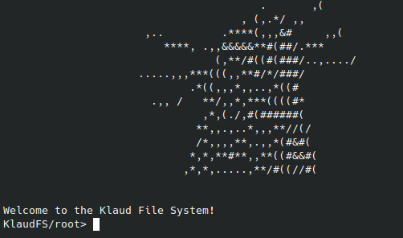

<h1 align="center">
  <br>
  <br>
  KlaudFS
  <br>
</h1>

<h4 align="center">The first Klaud themed File System</h4>

<p align="center">
  <a href="#how-to-use">How To Use</a> •
  <a href="#license">License</a>
</p>

<p align="center">
  
</p>

## How to Use
Make sure you have the below installed:
- gcc
- make
- valgrind (optional)

```bash
# clone project to your machine
$ git clone https://github.com/coldmayo/KlaudFileSystem.git

# conjure executable
$ make

# run the program
$ make run
```

Make sure you type --help in the CLI to get a full list of commands

## License

MIT